<h1>Yelp Dataset Analysis - Exploratory</h1>

In the first part of this project, I will be performing all the exploratory analysis on the Yelp dataset. There are visualizations on the analysis of the data as well as various maps to show the distribution of reviews/checkins across the continents. It is further analyzed into the sections where the review count is maximum (Las Vegas, Nevada)

<h3>Dataset</h3>

This project uses the Yelp Open Dataset:https://www.yelp.com/dataset/download, which includes 5 files:

*<b>Business: </b>Contains business data including location data, attributes, and categories.  
*<b>Review:</b> Contains full review text data including the user_id that wrote the review and the business_id the review is written for.  
*<b>User:</b> User data including the user's friend mapping and all the metadata associated with the user.  
*<b>Checkin:</b> Checkins on a business.  
*<b>Tip:</b> Tips written by a user on a business. Tips are shorter than reviews and tend to convey quick suggestions. 

For the purpose of my exploratory analysis, I am using the business, review, checkin dataset.

<h3>Things Done:</h3>

<ins>Plot for distribution of Reviews across stars (1,2,3,4,5)</ins>  
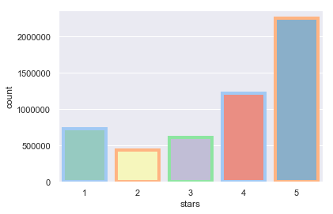  
<ins>Plot to show maximum category business. </ins>  
As, we can see, the maximum category of business is Restaurant, followed by Food and Shopping.  
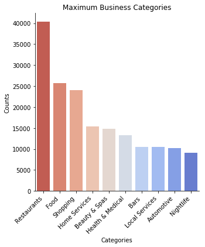  
<ins>World map to show where the restaurant businesses are scattered. </ins>  
I am using Basemap here with the 'hammer' projection to display the map. The background of the map is filled by etopo(). The red spots are the restaurant businesses included in the Business Dataset.  
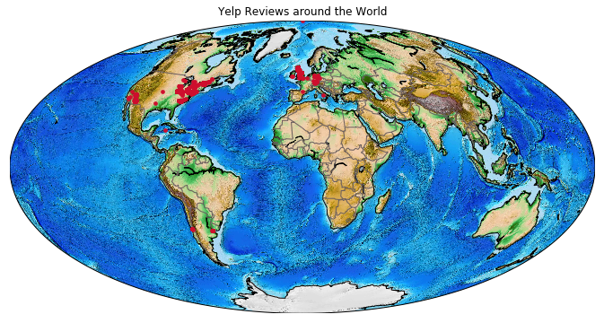  
<ins>Closer view of North America and Europe map for restaurant businesses.</ins>  
Again, I am using Basemap with bluemarble() for the background. The yellow spots are the restaurant businesses in the North America And Europe region  
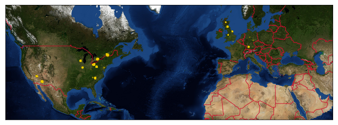  
<ins>Plot for Businesses with maximum Checkin counts</ins>  
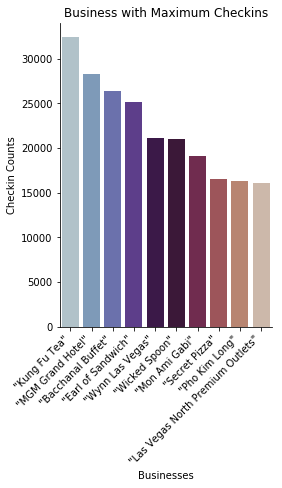  
<ins>Plot for Businesses with maximum Review counts</ins>  
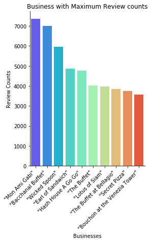  
<ins>Pie Chart of States with the maximum number of Checkins</ins>  
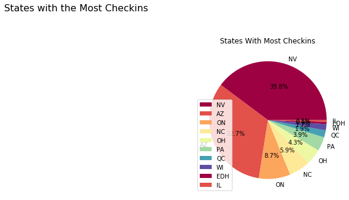  
<ins>Map - Arcgisimage of Nevada. </ins>  
As we can see from the above pie chard, Nevada has the maximum number of checkins. In the below map, I am analyzing the Nevada region in further detail. I am using arcgisimage with the service 'NatGeo_World_Map' to show the Nevada region. As we can see, most of the restaurant businesses are concentrated across the Las Vegas region.  
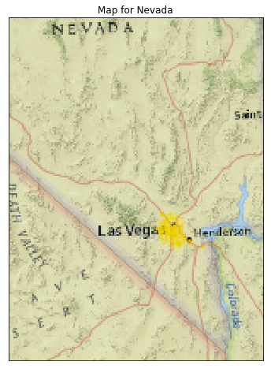  
<ins>Map - with inset function for Nevada. </ins>  
For this map, I am using the mark_inset function to give us a view of Las Vegas in a separate map inside the previous one  
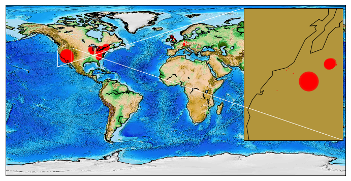  
<ins>Folium Map - With Headmap over time for review counts for Las Vegas. </ins>  
I am creating a heatmap over the time for the review_counts in the business/restaurant dataset by subsetting the location for Las Vegas. I will be using Folium Map with the plugin HeatMapWithTime  
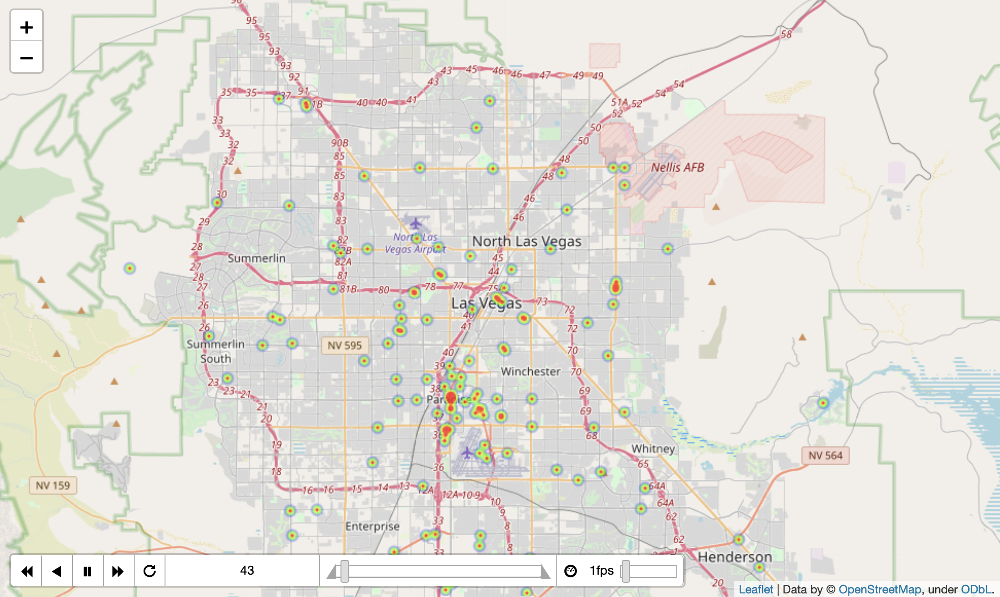  
<ins>States having average star ratings greater than 3 and less than 3.</ins>  
This results in a diverging plot  
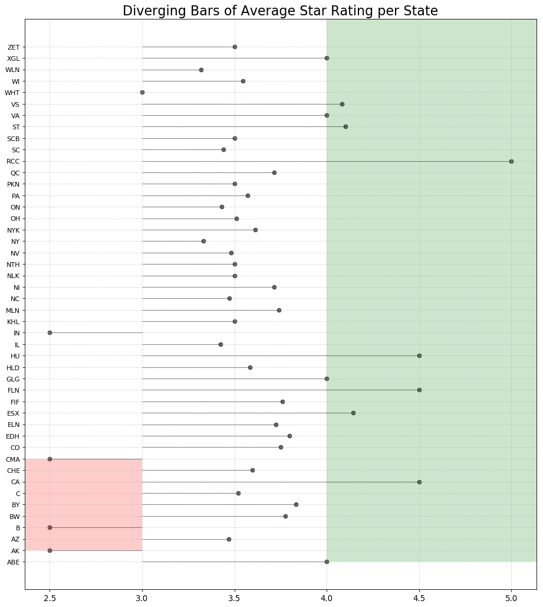  

